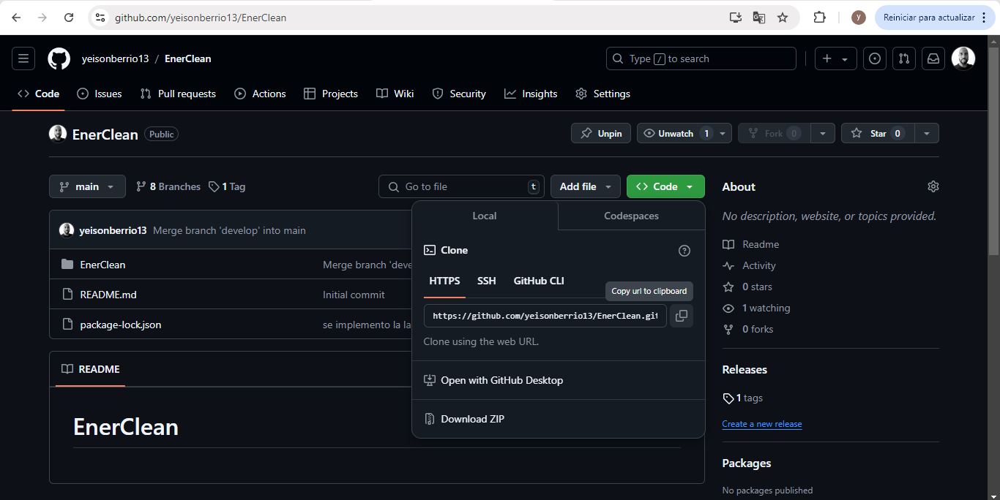
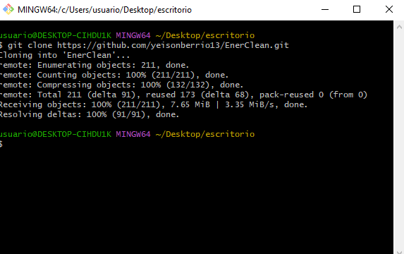
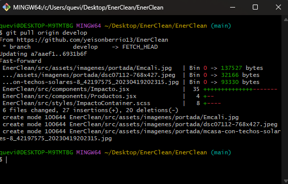
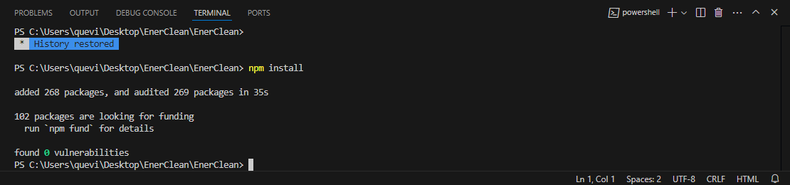
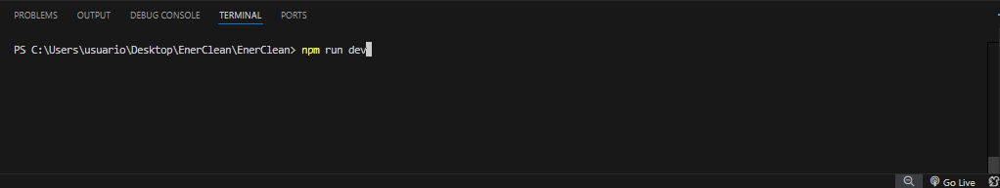
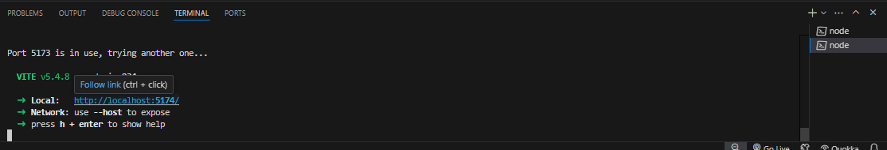
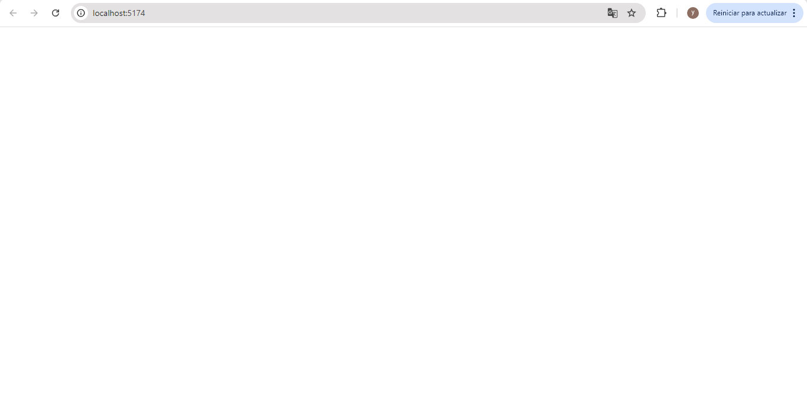
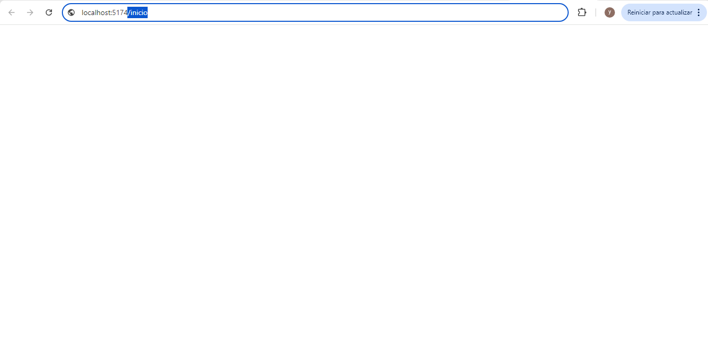
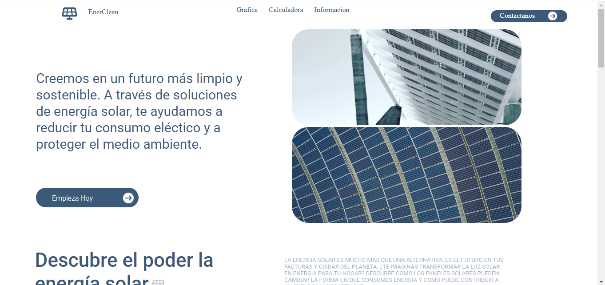

# EnerClean
proyecto sobre el ahorro de energia en barrios populares en Medellin
<!--   -->
# Pasos para correr el proyecto
#### para poder correr el proyecto es necesario realizar los siguientes pasos
1. instalar node js:
se dirige a la pagina de node js
https://nodejs.org/en/download/prebuilt-installer
y se descargar el instalador prebuild o latest (segun su preferecia) o puede ver el siguiente tutorial:
https://www.youtube.com/watch?v=29mihvA_zEA

2. se dirige a el repositorio y se copia la url 

3. se clonaria el proyecto con el comando git clone en git bash en el escritorio
el comando exacto con url seria: 
##### git clone https://github.com/yeisonberrio13/EnerClean.git 

y se procede a realizarse un pull al proyecto
con el comando:

#### git pull origin develop
despues de esto se iria a la subcarpeta con el comando:
### cd enerclean
 
y se inicia con el comando:
 
code .
 

4. en la terminal de visual studio code se realiza el siguiente comando:

#### npm install

5. se procede a escribir npm run dev en la terminal de visual studio code

6. al ingresar el comando anterior aparecera un link a un entorno virtual 
    

7. al ingresar al entorno virtual parecera la pagina en blanco como se muestra en la imagen 

para ver la pagina solo tendria que adicionarle el siguiente apartado a la direccion:

    #### /inicio
    

haciendo esto ya podra acceder a la pagina
    